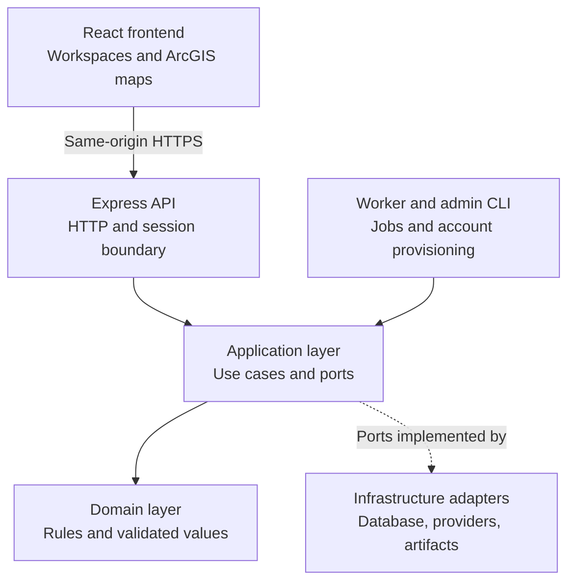
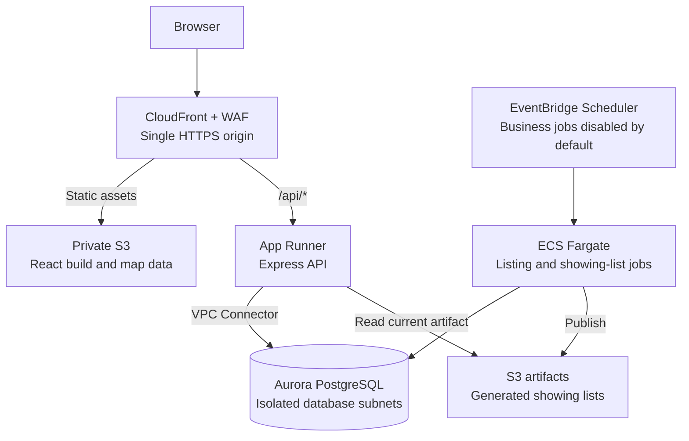
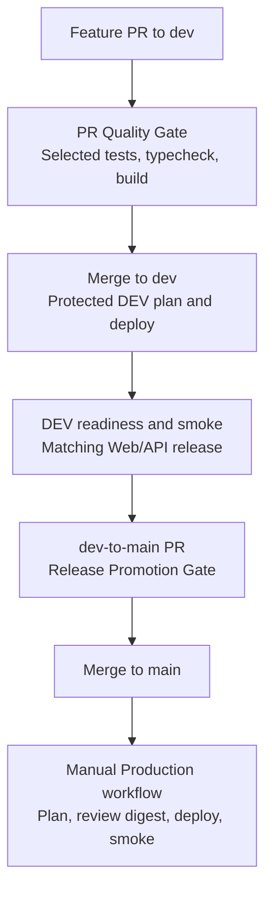
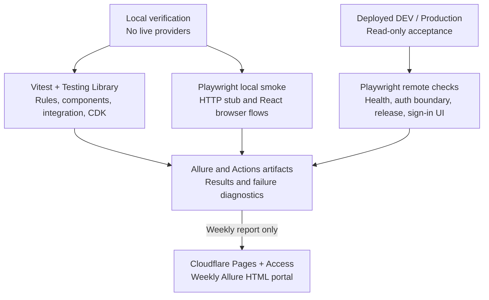

# chaoran-property-intelligence

A full-stack TypeScript real estate intelligence platform for property discovery,
interactive Web GIS, listing alerts, showing preparation, and evidence-based
price estimation. The application combines a React frontend, an Express API,
PostgreSQL persistence, and background workers with an AWS deployment and
GitHub Actions delivery pipeline.

Listing search and wildfire visualization cover seven Southern California
market contexts: **Chino, Chino Hills, Eastvale, Corona, Jurupa Valley,
Stevenson Ranch, and Irvine**. Incorporated markets use direct city queries;
Stevenson Ranch uses ZIP `91381` while retaining the provider's city label.
Existing saved search profiles keep their selected markets.

## Project at a glance

| Area | Main technologies | Responsibility |
| --- | --- | --- |
| Frontend | React, TypeScript, Vite, ArcGIS Maps SDK for JavaScript | Authenticated workspaces, interactive maps, terrain, and data presentation |
| Backend | Node.js, Express, shared TypeScript packages | HTTP APIs, authentication, business rules, and provider orchestration |
| Database | PostgreSQL, Aurora PostgreSQL Serverless v2 | Listings, users, search profiles, alert state, and showing-list drafts |
| Background jobs | ECS Fargate, EventBridge Scheduler | Listing acquisition, new-listing/price-drop alerts, and showing-list generation |
| AWS delivery | AWS CDK, CloudFront, S3, App Runner | Static web hosting, containerized API, private data access, and environment isolation |
| CI/CD | GitHub Actions, GitHub OIDC | Source verification, DEV deployment, release promotion, and controlled Production deployment |
| Testing and reports | Vitest, React Testing Library, Playwright, Allure | Layered verification, browser/API smoke, regression diagnostics, and report history |

The [public-launch completion record](docs/operations/block-29-completion-record.md)
documents deployed DEV and Production Web/API environments and accepted
Production 2D, 3D terrain, and wildfire-overlay behavior. The Production entry
point is [the authenticated CPI application](https://d1ayoi79dg623p.cloudfront.net).

Price Estimation is implemented in source; live provider access is enabled
separately per AWS stage. Its
[runtime enablement runbook](docs/runbooks/aws-price-estimation-runtime-enablement.md)
defines those flags, and the
[Price Decision documentation](docs/price-decision/README.md) records the remaining
live provider-contract acceptance work. Deployment workflows keep both business
job schedules disabled; enabling those jobs is a separate operational step.

## Application architecture

The API, worker, and administrator CLI compose the same application and domain
packages. Business rules remain independent of Express, AWS, and provider SDKs.
Adapters implement application-defined ports for persistence, authentication,
external data, messaging, and artifact delivery.



### Frontend

`apps/web` contains four authenticated workspaces:

| Workspace | User workflow |
| --- | --- |
| Listings | Browse stored listing snapshots, synchronize list and map selection, and create/edit/archive manual listings with confirmed map coordinates |
| Search Criteria | Save markets, property type, price, bedroom, and bathroom criteria with revision/conflict handling; each changed save queues an immediate background refresh |
| Showing List | Review, edit, reorder, and download the current generated showing-list draft |
| Price Estimation | Submit a California address for offer/listing guidance, comparable evidence, ranges, confidence, and limitations |

React owns selection, draft state, session handling, and workspace navigation.
Typed map drivers isolate ArcGIS lifecycle and rendering from the UI. The map
starts in **2D**; **3D Terrain** loads on demand using `arcgis-scene`,
World Elevation, and WebGL2. Mode changes preserve selection and desired overlay
visibility, while manual marker editing uses the 2D workflow.

The wildfire overlay uses a shared, versioned GeoJSON release in both modes.
A GDAL pipeline builds it from pinned CAL FIRE and boundary sources, validates
geometry and checksums, and publishes a provenance manifest. The browser loads
these same-origin assets only when requested. Terrain adds visual context;
official Moderate, High, and Very High classifications remain unchanged.

The client validates API responses and provides loading, empty, error, retry,
and session-expiry states. The ArcGIS browser key has referrer restrictions and
a bounded Content Security Policy; server credentials stay in backend runtimes.

ADR 0019 defines the implemented asynchronous refresh after a changed criteria
save, current-versus-historical listing lifecycle views, and visible
saved/applied run status. A queued run that no worker claims within five minutes
is shown as unavailable instead of spinning indefinitely and can be retried
explicitly.

Details: [ArcGIS migration](docs/knowledge-base/block-22-arcgis-map-engine-migration.md),
[3D terrain](docs/knowledge-base/block-23-3d-fire-terrain.md),
[wildfire data pipeline](tools/wildfire-hazard/README.md).

### Backend and integrations

`apps/api` exposes the authenticated application over Express.
`packages/application` coordinates use cases, and `packages/domain` defines
validated values, listing identity, search rules, and price-decision contracts.

- **Authentication:** Argon2id password hashing, signed JWTs in HttpOnly
  same-site cookies, current-user role/status checks, Origin validation,
  bounded request bodies, rate limits, and safe errors.
- **Listing acquisition and alerts:** the worker reads the saved search
  profile, queries RentCast by selected market, reconciles overlapping results,
  and records new-listing or price-drop events for Telegram delivery. Incomplete
  multi-market acquisition does not produce partial persistence or alerts.
- **Showing-list delivery:** application use cases coordinate structured
  OpenAI generation, the current PostgreSQL draft, PDF rendering, S3 artifacts,
  and Telegram delivery.
- **Price Estimation:** the API assembles RentCast evidence and runs a
  deterministic pricing engine. Optional OpenAI output explains the computed
  result; provider/model failures have bounded error or fallback behavior.
  The browser receives normalized evidence rather than raw provider payloads.

Provider calls, storage, and messaging live in separate adapter packages,
allowing the same use cases to run with production adapters or test fakes.
The administrator CLI provisions accounts through dedicated local, DEV, and
Production paths.

The criteria-refresh lifecycle keeps provider work in the background:
configuration commits first, a durable run is dispatched asynchronously, and
only a complete successful multi-market result replaces current membership.
Weekly reconciliation is configured for Monday at 08:00 Pacific, but both AWS
business schedules remain disabled by default and during feature rollout.

Details: [authentication and showing-list workflows](docs/knowledge-base/blocks-16-18.md),
[listing alerts](docs/knowledge-base/block-20-price-drop-alerts.md),
[Price Decision](docs/price-decision/README.md).

### Database and storage

The PostgreSQL adapter in `packages/postgres` uses versioned SQL migrations
and transaction-based repositories. Local development uses PostgreSQL;
AWS environments use private Aurora PostgreSQL Serverless v2.

| Data group | Main tables | Purpose |
| --- | --- | --- |
| Inventory | `listings` | Stable listing identity, provider/manual records, coordinates, current prices, and soft archival |
| Accounts | `users` | Administrator identity, password hash, role, and status |
| Search configuration | `listing_search_profiles` | Criteria plus saved/applied revisions and actor attribution |
| Alert processing | `alert_worker_state`, `listing_price_observations`, `listing_alert_events` | Baseline state, prior-price comparison, and pending/sent delivery tracking |
| Showing preparation | `current_showing_list_draft` | Latest structured draft and review state |

Alert transitions atomically update listing, observation, and event state.
A durable outbox retains pending delivery work for retry. Search-profile
revision checks prevent conflicting updates, and a newly applied profile
establishes a quiet baseline before normal alerting resumes.

Migration 008 adds `listing_search_runs` and `listing_search_memberships`. They
separate current applied
inventory from historical, missing, inactive, and out-of-scope records while
keeping `listings` as the latest canonical row. The proposed retention defaults
are 90 days for run detail and inactive/out-of-scope membership, 180 days for
unreferenced provider listings, and 365 days for retained alert events. Manual
listings are never automatically deleted.

Storage is split by purpose:

- **PostgreSQL:** operational records and the current structured showing draft.
- **S3:** generated showing-list artifacts and versioned web releases.
- **Static GeoJSON:** reviewed wildfire geometry delivered with the web build.

PostGIS, spatial columns, and geometry indexes remain deferred in
[ADR 0001](docs/adr/0001-persistence-direction.md). Current map rendering uses
listing coordinates and published GeoJSON. Price Estimation is stateless in the
current implementation; its requests, results, and AI output are not saved as
estimation history.

Schema details: [SQL migrations](packages/postgres/migrations),
[alert state and outbox](docs/adr/0008-price-drop-alert-state-and-outbox.md),
[search-profile persistence](docs/adr/0009-persisted-listing-search-criteria.md),
[proposed refresh lifecycle](docs/adr/0019-criteria-triggered-listing-refresh-and-lifecycle.md).

## AWS architecture

CloudFront provides one HTTPS origin for the web application and `/api/*`.
Static assets come from a private S3 bucket; API requests go to App Runner
without shared caching. Express reaches Aurora through an App Runner VPC
Connector. Background jobs run as separate ECS Fargate tasks.



- **Environment isolation:** DEV and Production have separate foundation,
  edge, and public-application stacks, databases, secrets, and roles.
  Application/data resources are in `us-west-2`; CloudFront-scope WAF is
  defined in `us-east-1`.
- **Access controls:** S3 uses Origin Access Control. CloudFront supplies
  origin-verification headers, and Express rejects direct application access
  through App Runner except for its public health probe. Secrets Manager
  supplies runtime credentials.
- **Provider connectivity:** the worker reaches RentCast, OpenAI, and Telegram
  over HTTPS. The API's default database connector has no NAT; stage-specific
  Price Estimation enablement adds dedicated egress subnets and one NAT Gateway
  for provider access. Aurora remains in isolated subnets.
- **Operations:** CloudWatch logs, EventBridge failure rules, SNS notifications,
  a Scheduler dead-letter queue, and budget alerts support troubleshooting.
  Retained data resources, immutable API images, and versioned web objects
  support recovery and rollback.

The diagram focuses on runtime services. IAM policies, alarms, and individual
subnets are documented in the
[AWS system design](docs/aws-system-design.md) and
[public runtime runbook](docs/runbooks/aws-public-runtime.md).
Use the [launch completion record](docs/operations/block-29-completion-record.md)
for later deployment evidence; earlier design documents also retain historical
pre-deployment status.

The refresh feature adds a stage-isolated asynchronous dispatch path
from a durable run identity to the existing Fargate worker. It does not place
RentCast credentials in App Runner or React, and its infrastructure acceptance
requires the property-alert schedule to remain `DISABLED` even after changing
the source expression from daily to Monday 08:00 Pacific.

## CI/CD

GitHub Actions separates source verification, deployment, and release promotion.
A feature PR enters `dev` through a dependency-aware quality gate. Deployable
changes then trigger a protected DEV plan/deploy workflow. Promotion to
`main` verifies the application actually running on AWS DEV.



| Workflow | Trigger and responsibility |
| --- | --- |
| [PR Quality Gate](.github/workflows/pr-quality-gate.yml) | PR to `dev`; classifies changed files, selects relevant suites, and uses the full fallback for shared or unknown impact |
| [Deploy DEV](.github/workflows/deploy-dev.yml) | Protected `dev` push after a merged PR, or manual dispatch; builds the candidate, validates ArcGIS assets, plans/deploys CDK, and runs remote smoke |
| [Release Promotion Gate](.github/workflows/release-quality-gate.yml) | `dev -> main` PR; verifies DEV health/release identity and runs all currently discovered remote-safe Playwright tests with flake checks |
| [Deploy production](.github/workflows/deploy-production.yml) | Manual `main` operation; verifies the candidate, produces a reviewed plan digest, then deploys and runs safe Production smoke |
| [Weekly DEV Regression](.github/workflows/weekly-dev-regression.yml) | Sunday at 10:00 PM `America/Los_Angeles`, or manual dispatch; tests deployed DEV and publishes protected Allure reports |

Documentation-only PRs record a successful source-gate skip. Documentation and
test-only DEV changes can skip deployment. The promotion and weekly gates accept
an older deployed ancestor only when every intervening change is classified as
non-runtime; otherwise the release check fails.

`/release.json` and `/api/release` must report matching commit and stage
identities. The release-promotion gate does not repeat local Vitest, typecheck,
or builds; those belong to source verification and artifact creation.
Production retains its own verification and explicit deployment controls.
AWS workflows use temporary OIDC credentials and protected GitHub environments.

Details: [exact DEV release promotion](docs/knowledge-base/block-30-exact-aws-dev-release-promotion.md),
[DEV delivery](docs/runbooks/aws-dev-deployment.md),
[Production delivery](docs/runbooks/release-production-delivery.md),
[weekly regression](docs/runbooks/weekly-dev-regression.md).

## Testing architecture

Tests are organized by the boundary they verify. Most Vitest tests are colocated
with source; Playwright system tests live under `tests/api` and `tests/ui`.
The diagram shows how verification feeds reporting, not a mandatory execution
order.



| Layer | What it verifies |
| --- | --- |
| Domain and application | Filtering, identity, alert transitions, profile revisions, deterministic valuation, and orchestration with fakes |
| Frontend | React interaction states, accessible controls, strict API clients, map lifecycle, and 2D/3D state replay |
| Backend and integration | Express middleware/routes, authentication, repository contracts, and cross-layer workflows using controlled fakes or in-memory SQL harnesses |
| Infrastructure and tooling | CDK template assertions, delivery workflow contracts, release classification, wildfire artifacts, and report tooling |
| Playwright local | Black-box HTTP and Chromium sign-in/listings/sign-out journeys against a local stub |
| Playwright remote | Deployed health, security headers, authentication rejection, release identity, and the public sign-in screen |

Local Playwright blocks external browser requests. Remote mode skips synthetic
login/logout and data-changing journeys. Live ArcGIS rendering, authenticated
Production workflows, and real provider acceptance are separate browser/operator
checks; passing smoke tests alone does not prove those behaviors.

Vitest and Playwright publish Allure results. GitHub artifacts retain diagnostic
reports, failure screenshots, and traces. Weekly regression allows one retry,
but an unregistered retry still fails its flake gate; quarantine entries require
an owner, evidence, and expiry.

Only the weekly workflow publishes the generated Allure HTML portal to
Cloudflare Pages, behind Cloudflare Access. Raw results, Playwright reports,
traces, and deployment evidence remain GitHub artifacts. The portal retains the
newest report per Pacific calendar day within a 30-day window and carries
bounded trend history. Cleanup runs weekly, so expired reports can remain until
the next run.

Details: [test framework](docs/testing/test-framework.md),
[flake and regression policy](docs/runbooks/weekly-dev-regression.md),
[protected Allure portal](docs/runbooks/allure-cloudflare-pages.md).

## Repository structure

```text
apps/
  web/              React workspaces and ArcGIS map drivers
  api/              Express routes and production composition
  alert-worker/     Listing alerts and showing-list job entrypoints
  admin-cli/        Local and stage-specific account provisioning
packages/
  domain/           Validated values, identity, and business rules
  application/      Use cases, ports, and deterministic pricing
  postgres/         Repositories and SQL migrations
  auth/             Password hashing and JWT adapters
  rentcast/         Listing and valuation evidence adapters
  openai/           Structured generation and explanation adapters
  telegram/         Notification delivery
  pdf/              Showing-list PDF rendering
  s3/               Artifact storage and retrieval
infra/aws/          TypeScript CDK stacks and infrastructure tests
tests/              Playwright API/UI tests, support, and flake registry
tools/              Wildfire pipeline, quality gates, releases, AWS, reports
.github/workflows/  Source, deployment, promotion, and weekly pipelines
docs/               Architecture decisions, feature records, and runbooks
```

## Local development

Use **Node.js 24** and **pnpm 11.19.0** to match the documented development
setup. The runtime package declares Node.js `>=22`. PostgreSQL is needed for
the local application; the default automated suite uses controlled test
dependencies.

Install dependencies and verify the source:

```bash
pnpm install --frozen-lockfile
pnpm test
pnpm typecheck
pnpm build
```

Prepare ignored `.env.local` using [.env.example](.env.example) and the
[local authentication runbook](docs/runbooks/local-auth-configuration.md):
configure a loopback `DATABASE_URL`, JWT signing values, local API settings,
and the referrer-restricted ArcGIS browser key. Start local PostgreSQL before
creating an administrator:

```bash
pnpm user:create-admin --email admin@example.com
```

The CLI prompts for the password and runs migrations before inserting the user.
See [Create a Local Administrator](docs/runbooks/create-local-admin.md).

Run the API and frontend in separate terminals:

```bash
# Terminal 1: bundled migrations, then API at 127.0.0.1:3000
pnpm api:start

# Terminal 2: frontend at 127.0.0.1:5173
pnpm web:dev
```

`pnpm api:start` also builds the alert worker. Saving changed Search Criteria or
selecting Retry launches that worker against the local database with the
`RENTCAST_API_KEY`, `TELEGRAM_BOT_TOKEN`, and `TELEGRAM_CHAT_ID` inherited from
`.env.local`. This is a live provider path: it consumes one RentCast request per
selected market and sends Telegram only when the reconciliation produces an
eligible alert. Merely starting the servers or using the read-only Listings
checks does not invoke either provider.

Open [the local application](http://127.0.0.1:5173). Vite proxies `/api`
to Express so the browser uses one origin. Confirm the read path with the
[local vertical-slice runbook](docs/runbooks/local-listings-vertical-slice.md).
Run Playwright local smoke separately from these development servers because
its harness uses a dedicated API stub.

### Verification commands

| Command | Scope |
| --- | --- |
| `pnpm test` | Complete Vitest suite |
| `pnpm test:frontend` / `pnpm test:backend` | Focused frontend or backend suites |
| `pnpm test:integration` | Cross-layer integration harnesses |
| `pnpm test:infra` / `pnpm test:quality-gate` | Infrastructure or source-gate logic |
| `pnpm test:e2e:install-browsers` | Install Chromium for Playwright |
| `pnpm test:e2e:smoke` | Local API and browser smoke |
| `pnpm test:all` | Vitest followed by local smoke, with combined Allure results |
| `pnpm report:allure` | Generate the local HTML report |
| `pnpm typecheck` / `pnpm build` | Workspace type checking or runtime/web/infrastructure build |
| `pnpm verify:local` / `pnpm alert-worker:dry-run` | Worker integration scenario or fixture-driven CLI |
| `pnpm wildfire:data:test` | Wildfire pipeline and published-artifact checks |

The main Vitest and Playwright test scripts clean prior Allure output. Use `pnpm test:all`
when a combined Vitest/Playwright report is needed. Live worker runs, cloud
deployments, provider audits, and data publication use the dedicated runbooks
below.

## Documentation guide

| Topic | Start here |
| --- | --- |
| Feature progress and planned work | [Roadmap](docs/roadmap.md) |
| Design rationale | [Architecture decision records](docs/adr) |
| AWS topology and launch evidence | [System design](docs/aws-system-design.md), [launch completion](docs/operations/block-29-completion-record.md) |
| Deployment and rollback | [DEV](docs/runbooks/aws-dev-deployment.md), [Production](docs/runbooks/release-production-delivery.md) |
| Provider access for Price Estimation | [Runtime enablement](docs/runbooks/aws-price-estimation-runtime-enablement.md) |
| Multi-market acquisition | [Direct-city coverage](docs/knowledge-base/block-26-five-city-direct-market-coverage.md), [Irvine coverage](docs/knowledge-base/block-27-irvine-market-and-wildfire-coverage.md) |
| Map data provenance | [Source audit](docs/data/wildfire-hazard-source-audit.md), [wildfire builder](tools/wildfire-hazard/README.md) |
| Alerts and scheduled delivery | [Price-alert readiness](docs/runbooks/price-alert-production-readiness.md), [Showing List](docs/runbooks/showing-list-production.md) |
| Criteria refresh and listing retention | [ADR 0019](docs/adr/0019-criteria-triggered-listing-refresh-and-lifecycle.md), [implementation plan](docs/listing-refresh/implementation-plan.md), [acceptance plan](docs/runbooks/listing-refresh-lifecycle-acceptance.md) |
| Quality and reports | [Testing architecture](docs/testing/test-framework.md), [weekly regression](docs/runbooks/weekly-dev-regression.md), [Allure portal](docs/runbooks/allure-cloudflare-pages.md) |
| Future visualization scope | [Price Decision / Block 32 boundary](docs/price-decision/README.md#block-32-boundary) |

School proximity, comparable-property maps, heatmaps, and database spatial
indexes remain planned work. Feature records and ADRs preserve implementation
history; dated operation records describe accepted deployments, while code and
workflow definitions specify the current implementation.
