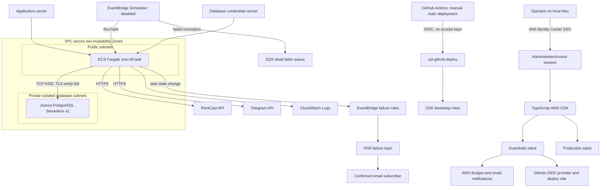
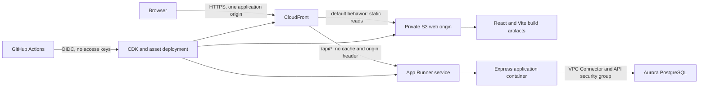
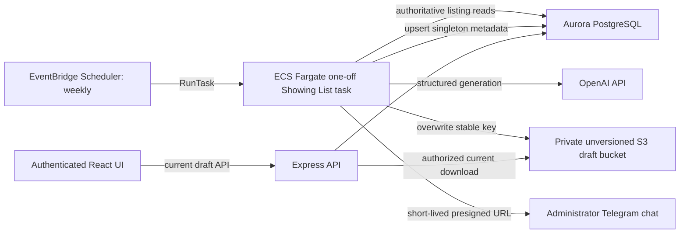

# AWS System Design and Configuration

## Purpose

This document describes the deployed AWS architecture for
`chaoran-property-intelligence`. It is primarily the as-built system view:
resource boundaries, identity, networking, runtime flow, security controls,
deployment configuration, observability, cost controls, and resource lifecycle.
Future resources are included only in sections explicitly labeled as planned.

The TypeScript CDK code under `infra/aws` remains the infrastructure source of
truth. This document explains that code; the deployment runbook owns commands
and operator procedures. ADR 0002 owns the deployed worker foundation, ADR 0003
owns the planned React and Express production boundary, ADR 0006 owns the
planned latest-only Showing List publication boundary, and ADR 0008 owns the
implemented-but-not-deployed price-drop observation, notification-outbox,
Telegram, and worker-composition boundary.

## Deployment Status

Last verified: 2026-08-22.

| Item | Verified state |
| --- | --- |
| AWS Region | `us-west-2` |
| CDK bootstrap | `CDKToolkit`, bootstrap version 32, `CREATE_COMPLETE` |
| Guardrails stack | `ChaoranPropertyIntelligenceGuardrails`, `CREATE_COMPLETE` |
| Production stack | `ChaoranPropertyIntelligenceProduction`, `UPDATE_COMPLETE` |
| Schedulers | Daily `DISABLED`; weekly not deployed |
| Aurora | Available, private, encrypted, deletion-protected, 0-1 ACU |
| Failure email | SNS subscription confirmed |
| Application secret | Three required keys populated and verified without logging values |
| Worker execution | Block 14 baseline complete: marker present, baseline 28, pending 0, sent 0 |
| Telegram smoke test | Block 14.1 complete; one fixed message delivered and confirmed |
| Block 20 worker code | Composition and offline verification complete; not deployed |
| Block 21 precheck | Metadata-only; ECS running 0/pending 0 and no resource mutation |
| Template drift | Guardrails clean; reviewed Production diff keeps both local schedules disabled |

The AWS account ID, IAM Identity Center portal URL, alert email, and all secret
values are intentionally excluded from the repository.

The React web application, Express API, and weekly Showing List publisher are
not deployed. Their approved AWS target boundaries are documented below as
planned architecture and must not be read as current stack inventory.

## Architecture



## Planned Authenticated Web and API Boundary

**Status: approved target architecture; not deployed.** Public implementation
is gated on Block 16 server-enforced authentication and a production security
review.



### React static origin

- AWS, rather than Vercel, is the selected production platform.
- `pnpm build:web` produces `apps/web/dist`; only those static artifacts are
  published to the web bucket.
- The S3 bucket keeps all Block Public Access controls enabled and grants read
  access only to CloudFront through Origin Access Control.
- The default CloudFront behavior serves `index.html` and static assets over
  HTTPS. Hashed JavaScript and CSS use long-lived immutable caching;
  `index.html` uses a short or disabled cache policy so releases become visible.
- The browser receives no database, RentCast, Telegram, AWS, or server signing
  credentials.
- Client-side route fallback must be designed when Block 16 introduces routes;
  it must never rewrite `/api/*` failures to `index.html`.

### Express API origin

- CloudFront routes `/api/*` to an AWS-hosted Express origin under the same
  public HTTPS origin used by the React application.
- The API behavior disables shared caching and forwards only the cookies,
  headers, query strings, and HTTP methods required by the authenticated API.
- Express performs authentication and authorization on every protected route.
  Neither CloudFront nor React route guards are an authorization boundary.
- The browser and API use one CloudFront HTTPS origin. The accepted flow does
  not enable CORS. Express requires an exact configured `Origin` for unsafe
  methods and uses `SameSite=Strict` HttpOnly cookies as an additional control.
- A short-lived JWT identifies a candidate user, but each protected request
  reloads current role and status from Aurora before authorization. Disabled or
  missing users are rejected before listing data is returned.
- The API runtime uses a dedicated least-privilege IAM role, a dedicated
  security group, TLS database validation, bounded timeouts, and private Aurora
  connectivity.
- App Runner is the selected compute target. It deploys the API as an image from
  private ECR and uses a VPC Connector in private subnets for outbound database
  traffic. The connector security group is the only new principal allowed into
  the Aurora security group.
- App Runner service ingress remains on its managed public hostname. CloudFront
  overwrites a dedicated origin verification header, and Express rejects a
  missing or mismatched value before authentication. The value is generated and
  rotated through CDK and is never exposed to browser code. The only bypass is
  `GET /api/health`, which returns no application data and performs no database
  query so App Runner can probe the container directly.
- The App Runner instance role can read only the production database secret and
  the separate API-auth secret. It does not receive RentCast or Telegram
  credentials because the API does not call either service.
- The first configuration uses `0.25 vCPU`, `0.5 GB`, and a minimum of one
  provisioned instance. At the current `us-west-2` memory rate, the idle memory
  baseline is approximately USD 2.56 per 730-hour month, plus active CPU,
  CloudWatch, ECR, data transfer, CloudFront, and database charges.
- The service does not use RDS Proxy because its retained database connections
  would prevent Aurora Serverless v2 from auto-pausing. Health checks must not
  query the database. The API connection timeout and startup path must tolerate
  Aurora resume latency.
- App Runner reserves `PORT`. The production composition root must bind to
  `0.0.0.0` using an explicitly validated deployment mode while preserving the
  current loopback-only local default.
- CloudFront WAF applies a rate-based rule scoped to `POST /api/auth/login`.
  The application also limits login before Argon2 verification, but its local
  counters are defense in depth rather than the distributed production control.
- API authentication values live in a separate retained Secrets Manager secret
  and never share the worker's RentCast or Telegram secret.

Lambda was not selected because the existing Express and `node-postgres`
runtime would need additional VPC and database lifecycle work, while Lambda
function URL origin protection adds signed-payload requirements for future POST
routes. ECS Fargate behind an internal load balancer provides a stronger private
origin, but its continuously running task and load balancer are disproportionate
for the current low-traffic single-user application. Revisit the choice if
traffic, compliance, or private-ingress requirements materially change.

### Deployment and certificate boundary

The future resources remain CDK-managed and use the existing branch-restricted
GitHub OIDC deployment path. No long-lived AWS keys are introduced. CloudFront
is global; application resources remain in the approved `us-west-2` project
region. A custom-domain CloudFront certificate, when introduced, is managed in
the AWS region required by CloudFront and reviewed as part of the deployment
change.

The web/API rollout order is:

1. Complete the local map/list vertical slice and Block 15.5 review.
2. Add and verify Block 16 server-side authentication and origin controls.
   **Complete in local code and automated tests.**
3. Implement the selected App Runner service and review the CDK diff,
   networking, cost, observability, rollback, and retained resources.
4. Deploy without changing the worker scheduler state.
5. Verify HTTPS, static caching, `/api/*` no-cache behavior, direct-origin
   restrictions, authentication, logout, and budget alerts.

## Planned Weekly Showing List Publication Boundary

**Status: weekly publisher implemented in source through Block 18.8; not
deployed or enabled.**
This workflow is separate from the existing disabled daily property-alert
schedule.

Blocks 18.6.1 through 18.8 have implemented the application persistence
contracts, PostgreSQL adapter, bundled singleton migration, bounded PDFKit
renderer, current-artifact store port, stable-key AWS SDK v3 S3 adapter, and
dedicated private unversioned bucket definition in source. The application also
owns the ordered publication use case, optimistic review mutations, bounded
review DTOs, authenticated Express routes, React review workspace, and an S3
reader that guards downloads with the current database ETag. The worker image
also owns real-provider composition, deterministic weekly identity, stable-key
presigning, bounded Telegram delivery, and a distinct weekly Fargate task and
Scheduler definition. Migration 005 has not been applied to Aurora or a local
database, and no real renderer, S3, database, model, or Telegram call was made.
Least-privilege weekly-task S3 access is defined in CDK. The production API IAM
role, deployed runtime configuration, expanded application Secret, task,
schedule, and API service remain unprovisioned.



The deployed Express runtime requires both
`SHOWING_LIST_ARTIFACT_BUCKET=<generated private bucket name>` and the
unhyphenated 12-digit `AWS_ACCOUNT_ID`. They are server-side variables, never
`VITE_*` variables. When both are absent in local development, the API keeps
review routes available but returns a bounded `503` for PDF download. Supplying
only one or an invalid value fails startup configuration validation. The future
API task role receives only `s3:GetObject` on
`showing-lists/current.pdf`; Block 18.7 does not grant that permission or deploy
the API service.

### Retention and publication contract

- Application-visible primary storage contains at most one current structured
  draft row and one current artifact object.
- The weekly task reads an explicit current server-side generation
  configuration. It never infers selected listings from browser memory; a
  missing or invalid configuration leaves current storage unchanged.
- The artifact uses one stable key such as
  `showing-lists/current.<format>`. Successful publication overwrites that key;
  it never writes a date-based or generation-based history key.
- The dedicated artifact bucket is separate from the React static-asset bucket,
  blocks all public access, keeps versioning disabled, and does not enable S3
  Object Lock. Enabling versioning would retain and bill overwritten object
  versions, which violates the latest-only cost boundary.
- The bucket applies server-side encryption and aborts incomplete multipart
  uploads after a short bounded period. It has no noncurrent-version lifecycle
  because noncurrent versions must never be created.
- The task role receives only the S3 actions needed for the stable object key,
  the current database record, its model and Telegram secrets, and bounded log
  publication.
- Generate, validate, and render the complete artifact before replacing the
  current key. A failure before or during publication keeps the old current
  draft available and sends no Telegram message.
- After S3 publication, the task upserts singleton metadata with the generation
  ID and object ETag. Retries reconcile those values idempotently and do not
  create another object.
- The application performs one bounded metadata reconciliation attempt with the
  identical generation ID, ETag, and persistence payload. It does not regenerate,
  rerender, or reupload during that attempt, and it does not retry an identity
  conflict.

Latest-only applies to application-visible primary storage. Aurora automated
backups retain database changes for their configured seven-day window, and
CloudWatch retains bounded non-content operational events for seven days. The
artifact body and presigned URL must not enter logs.

### Telegram delivery contract

Only after successful publication and metadata commit does the task generate a
short-lived S3 presigned URL and send it to the configured administrator chat.
The bucket remains private. The URL expires at the earlier of its configured
expiry or the ECS task's temporary IAM credential expiry, is never persisted or
logged, and requests download content disposition.

Every URL targets the stable current key. An old message therefore cannot
retrieve a retained old draft; while its link remains valid, it resolves to the
current object. Telegram delivery failure does not roll back the current draft.
The singleton record retains a bounded `pending`, `sent`, or `failed` delivery
state, generation ID, and sent timestamp for retry and duplicate suppression.
The task makes at most two in-process delivery attempts. Its generation ID is
derived from the local calendar week and parsed generation configuration, so a
same-week recovery skips OpenAI and publication when that generation already
exists. A Telegram timeout still has an unknown delivery outcome and can create
one duplicate message during the bounded retry.

### Schedule and cost boundary

- The production cadence is once per week, with weekday, time, time zone, and
  enabled state supplied explicitly at deployment.
- The weekly schedule is a separate EventBridge Scheduler resource and cannot
  enable or mutate `cpi-daily-property-alert`.
- Initial enablement requires a reviewed CDK diff, explicit deployment
  approval, secret-shape validation, and a manual non-recurring smoke test.
- Storage growth is bounded to one active artifact and one current database
  row. Requests, data transfer, model use, Fargate execution, database backups,
  logs, and Telegram delivery can still incur usage-based cost.

## Account and Identity Configuration

AWS workforce access uses an organization instance of IAM Identity Center in
`us-west-2` with the default Identity Center directory.

| Configuration | Value |
| --- | --- |
| Administrator group | `CPI-Administrators` |
| Initial deployment permission set | `AdministratorAccess` |
| Local AWS CLI profile | `cpi-admin` |
| Authentication method | Browser-based `aws sso login` with temporary credentials |
| Long-lived AWS access keys | Not used |

The local root login cache was removed after the federated administrator role
was verified. The named `cpi` profile may still exist in local AWS config, but it
must not be used for project operations.

`AdministratorAccess` supports the initial account bootstrap and the broad set
of services created by CDK. It is an intentionally privileged operator role,
not an application runtime identity. Future work can replace it with a narrower
deployment permission set after the required CloudFormation and bootstrap
permissions are measured.

## CloudFormation Stack Boundaries

### `CDKToolkit`

The standard CDK bootstrap stack owns the deployment plumbing:

- S3 staging bucket for file assets
- ECR repository for container assets
- file and image publishing roles
- lookup role
- deployment action role
- CloudFormation execution role
- SSM bootstrap version parameter

The bootstrap CloudFormation execution role currently uses the AWS managed
`AdministratorAccess` policy. The GitHub deployment role may assume only the
standard `cdk-hnb659fds-*` bootstrap roles and read the bootstrap version
parameter.

### `ChaoranPropertyIntelligenceGuardrails`

This stack is deployed before application resources and owns account-level
project controls:

- retained budget named `cpi-monthly-gross-cost`
- GitHub Actions OIDC provider for `token.actions.githubusercontent.com`
- IAM role named `cpi-github-deploy`

The budget is monthly gross cost: credits and refunds are excluded from its cost
calculation. With the current `$20` parameter, notifications are:

| Notification | Threshold |
| --- | --- |
| Actual cost | 50% (`$10`) |
| Actual cost | 80% (`$16`) |
| Actual cost | 100% (`$20`) |
| Forecasted cost | 100% (`$20`) |

AWS Budgets is an alerting control, not a hard spending cap, and its data can
lag actual service usage.

### `ChaoranPropertyIntelligenceProduction`

This stack owns the worker runtime and persistence resources:

- VPC, subnets, route tables, internet gateway, and security groups
- Aurora PostgreSQL Serverless v2 cluster and writer
- database and application Secrets Manager secrets
- ECS cluster, task definition, execution role, and task role
- EventBridge Scheduler schedule and scheduler role
- SQS scheduler dead-letter queue
- CloudWatch log group
- EventBridge task-failure rules
- SNS failure topic and email subscription

The production stack depends on the guardrails stack so deployment order cannot
place application resources ahead of project cost and access controls.

## Network Design

The VPC spans two Availability Zones and creates one public and one isolated
database subnet per AZ. Each subnet uses a `/24` CIDR selected by CDK from the
VPC address space.

| Component | Inbound | Outbound | Publicly reachable |
| --- | --- | --- | --- |
| Fargate worker | No security-group ingress | All IPv4 egress | Receives a temporary public IP only while running |
| Aurora writer | TCP 5432 from the worker security group only | Disabled | No |

There is no NAT gateway. The short-lived worker runs in a public subnet so it
can call RentCast and Telegram over HTTPS. A public IP does not by itself allow
inbound traffic; the worker security group has no ingress rules.

Aurora runs only in isolated subnets. It has no route to the internet and no
CIDR-based PostgreSQL ingress. Database access is expressed as a
security-group-to-security-group rule.

## Worker Runtime

EventBridge Scheduler targets an ECS Fargate one-off task:

| Setting | Value |
| --- | --- |
| Schedule name | `cpi-daily-property-alert` |
| Planned expression | Every day at 8:00 AM |
| Time zone | `America/Los_Angeles` |
| Current state | `DISABLED` |
| Fargate CPU | 256 CPU units |
| Fargate memory | 512 MiB |
| CPU architecture | X86_64 |
| Operating system | Linux |
| Platform version | Latest |
| Hard process limit | 15 minutes |
| RentCast request timeout | 30 seconds, no automatic retry |
| Scheduler retry attempts | 2 |
| Maximum scheduler event age | 1 hour |
| Dead-letter retention | 14 days, SQS-managed encryption |

The container command is:

```text
timeout --signal=TERM 15m node apps/alert-worker/dist/index.js --run
```

The image is built from the repository `Dockerfile`, published to the CDK
bootstrap ECR repository, and referenced by the ECS task definition. The image
asset is explicitly built for `linux/amd64`, matching the task definition's
X86_64 runtime on both Apple Silicon developer machines and GitHub's Linux
runner. The image contains the AWS RDS global certificate bundle. Its directory
is mode `0755` and the public CA file is mode `0444`, allowing the non-root
`node` runtime user to validate Aurora's certificate chain.

For controlled operations, the same image exposes `--verify-baseline`. That
mode uses only the database connection, performs no migration or external HTTP
request, and logs only schema readiness, migration state, the baseline marker,
and aggregate baseline/pending/sent counts. It is used before and after the
first production run from inside the VPC because Aurora is not publicly
reachable.

Block 20 adds `--verify-price-alerts` and `--prepare-price-alerts` so the
price-alert rollout does not couple database preparation to provider or
notification traffic. Verification reads only migration 006, the independent
price baseline marker, and aggregate observation/event counts. Preparation
applies bundled migrations and conditionally converts legacy alert state; it
loads only PostgreSQL configuration and makes no external HTTP request.

The image also exposes `--telegram-smoke-test` for a controlled one-message
delivery check. That mode loads only the Telegram bot token and chat ID, sends a
fixed non-listing message, and does not create a database connection or a
RentCast client.

### Block 20 Price-Drop Evolution

**Status: detection, migration 006, PostgreSQL, Telegram, and worker composition
are implemented and verified offline; deployment is not complete.**
Block 20 extends the existing daily worker so a lower observed
price at the same canonical RentCast address creates a durable Telegram event.
The repository flow separates the current listing snapshot, latest address-level
price observation, and immutable pending/sent notification event. This keeps
one API and React listing row while preserving previous/current prices across a
Telegram retry.

The existing Fargate task, disabled `cpi-daily-property-alert` Scheduler,
application secret, VPC path, log group, DLQ, and IAM boundaries are sufficient.
Block 20 does not plan a new AWS service, schedule, credential, public endpoint,
or browser secret. A future approved deployment will update the worker image
and apply a PostgreSQL migration inside the existing runtime boundary.

Migration 006 adds `listing_price_observations` and `listing_alert_events` to
the existing Aurora database. The adapter protects observation transitions with
transaction-level address locks, preserves immutable pending payloads for
retry, and conditionally converts legacy pending new-listing rows. Existing
rows are initially non-comparable so the first fresh provider result cannot be
misread as a historical price drop. The migration remains unapplied to Aurora
until the database-only preparation task receives separate approval. Migration
006 is additive; application rollback restores the earlier ECS task definition
without deleting the new tables or migration record.

The 2026-08-22 Block 20.7C read-only precheck confirmed that the current AWS
stack still lacks the weekly Showing List resources and runs alert task
definition revision 7 with the daily Scheduler disabled. The reviewed
`--no-change-set` diff adds the documented weekly resources in a disabled state
and replaces the alert-worker image. It does not change the database, VPC,
retained resources, or schedule enabled states. The combined rollout remains a
separately approved future operation.

The currently deployed image still filters out prices below `$780,000` and
predates Blocks 21.6 and 21.7. Repository code now loads the persisted primary
search profile after bundled migrations and before constructing the alert,
provider, or notification adapters. It projects property type, maximum price,
minimum bedrooms, and minimum bathrooms into one regional RentCast request with
`price=*:<maximumPrice>`, `limit=500`, and `includeTotalCount=true`; city and
minimum-price decisions remain Domain filters. Missing or malformed profiles
fail closed. An unapplied profile revision now performs one provider request
and an atomic silent baseline: PostgreSQL locks the profile and candidate
addresses, refreshes full-criteria inventory plus already tracked below-floor
addresses, preserves all outbox events, and advances `applied_revision` only
with the baseline writes. Existing pending events are delivered after commit.
A response total above 500 or an incomplete below-cap page stops before
baseline, listing state, or Telegram mutation. Migration 007, a real production
provider run, production
listing Telegram delivery, image deployment, and schedule enablement each
remain separately confirmed operations.

Block 20.1A implements the audit as a separate maintenance entrypoint, not as a
mode of the scheduled production worker. It requires the exact
`--execute-one-request` argument before `fetch`, loads only `RENTCAST_API_KEY`,
uses `price=*:850000`, `limit=500`, and `includeTotalCount=true`, and emits only
aggregate measurements. The ordinary worker still used
`price=780000:850000` through Block 20.4. No real audit request or AWS operation
was performed in 20.1A. Block 20.1B later used one explicitly approved request:
all 132 matching rows were returned, 54 were below `$780,000`, and the result
retained 368 rows of margin below the 500-row cap. The request took 6,089 ms and
returned a 148,427-byte body. Block 20.5 then adopted the broadened profile in
repository code, using deterministic adapters and fixtures only. No database,
Telegram, or AWS operation accompanied it, and the deployed worker remains
unchanged.

## Database Design

| Setting | Value |
| --- | --- |
| Engine | Aurora PostgreSQL 16.13 |
| Writer class | Serverless v2 |
| Capacity | Minimum 0 ACU, maximum 1 ACU |
| Automatic pause | 5 idle minutes |
| Default database | `property_intelligence` |
| Database user | `property_worker` |
| Encryption | Enabled |
| PostgreSQL SSL | `rds.force_ssl=1`; client uses `verify-full` |
| Backups | 7-day retention |
| Deletion protection | Enabled |
| Stack removal policy | Retain |

The worker receives host, port, and database name as non-secret environment
variables. Username and password are injected from Secrets Manager. The worker
does not use the local developer `DATABASE_URL` in AWS.

## Secrets

| Secret | Required content | Lifecycle |
| --- | --- | --- |
| `cpi/production/database` | Generated `username` and `password` | Retained with production data |
| `cpi/production/application` | `RENTCAST_API_KEY`, `OPENAI_API_KEY`, `SHOWING_LIST_GENERATION_CONFIG`, `TELEGRAM_BOT_TOKEN`, `TELEGRAM_CHAT_ID` | Destroyed with the production stack |
| `cpi/production/api-auth` | `JWT_SIGNING_SECRET`, `JWT_ISSUER`, `JWT_AUDIENCE`, `ALLOWED_ORIGIN`, `ORIGIN_HEADER_SECRET` | Retained and rotated with coordinated API deployment |

Application values originate in the ignored local `.env.local` file. The sync
command validates all five values, writes the AWS CLI payload to a random
owner-only (`0600`) temporary file, invokes Secrets Manager, and removes the
temporary directory in a `finally` block. Values are never placed in command
arguments or printed.

Secret values must not be stored in Git, GitHub repository variables, issues,
logs, documentation, or chat. GitHub Actions does not need provider, Telegram,
or generation values because infrastructure deployment preserves the existing
application Secret value.

## Observability and Failure Handling

| Signal | Destination | Behavior |
| --- | --- | --- |
| Worker stdout/stderr | `/cpi/production/alert-worker` | CloudWatch retention of 7 days |
| Scheduler target failure | SQS dead-letter queue | 2 retries, maximum event age 1 hour |
| ECS `TaskFailedToStart` | EventBridge rule to SNS | Email notification |
| ECS non-zero container exit | EventBridge rule to SNS | Email notification |
| Gross AWS cost | AWS Budgets | Actual and forecast email thresholds |

The SNS topic is `cpi-production-worker-failures`, enforces TLS for publishing,
and has a confirmed email subscription. Both task-state EventBridge rules are
enabled even while the scheduler is disabled, so manually or subsequently
scheduled tasks remain observable.

## Deployment Paths

### Local deployment

Local account access uses the `cpi-admin` SSO profile. CDK resolves the account
from `CDK_DEFAULT_ACCOUNT` and defaults to `us-west-2`; `CPI_AWS_REGION` exists
only as an intentional project-level override.

Local mutation requires all of the following:

1. SSO identity and target account verification.
2. Tests, typecheck, build, synth, and `git diff --check` passing.
3. Review of `cdk diff` and retained resources.
4. Explicit approval before bootstrap, deploy, secret synchronization, or
   teardown.

### GitHub Actions deployment

`.github/workflows/deploy-production.yml` is designed for repeat deployments:

- manual `workflow_dispatch` only
- exact confirmation input `deploy-production`
- `main` branch only
- one non-canceling `production-deployment` concurrency group
- `contents: read` and `id-token: write` permissions only
- tests, typecheck, and build before AWS authentication
- immutable commit SHA pins for every action
- a 45-minute job timeout
- `scheduleEnabled=false` on every deployment
- `showingListScheduleEnabled=false` and explicit weekly weekday, hour, minute,
  and time zone on every deployment
- temporary AWS credentials obtained through OIDC

The OIDC trust conditions are exact:

```text
aud = sts.amazonaws.com
sub = repo:Shaobangzhu/chaoran-property-intelligence:ref:refs/heads/main
```

No AWS access key or secret access key is stored in GitHub. Repository
configuration required before publishing the workflow is:

| GitHub setting | Type | Purpose |
| --- | --- | --- |
| `AWS_ACCOUNT_ID` | Variable | Builds the OIDC deployment role ARN |
| `CPI_MONTHLY_BUDGET_USD` | Variable | Guardrails stack parameter; defaults to 20 |
| `CPI_ALERT_EMAIL` | Secret | Budget and worker-failure email parameter |

## Configuration Contract

| Name | Location | Sensitive | Consumer |
| --- | --- | --- | --- |
| `CPI_AWS_REGION` | Local process environment | No | CDK environment resolver |
| `CPI_AWS_PROFILE` | Local process environment | No | Application Secret sync; defaults to `cpi-admin` |
| `CDK_DEFAULT_ACCOUNT` | Local process environment | No | CDK account binding |
| `CPI_ALERT_EMAIL` | `.env.local`; GitHub secret | Personal data | Both CloudFormation stacks |
| `CPI_MONTHLY_BUDGET_USD` | `.env.local`; GitHub variable | No | Guardrails stack |
| `RENTCAST_API_KEY` | `.env.local`; AWS Secret | Yes | Worker container |
| `OPENAI_API_KEY` | `.env.local`; AWS Secret | Yes | Weekly Showing List task |
| `SHOWING_LIST_GENERATION_CONFIG` | `.env.local`; AWS Secret | Client/listing configuration | Weekly Showing List task |
| `TELEGRAM_BOT_TOKEN` | `.env.local`; AWS Secret | Yes | Worker container |
| `TELEGRAM_CHAT_ID` | `.env.local`; AWS Secret | Yes | Worker container |
| `JWT_SIGNING_SECRET` | `.env.local`; API-auth Secret | Yes | Express API only |
| `JWT_ISSUER` | `.env.local`; API-auth Secret | No | Express API only |
| `JWT_AUDIENCE` | `.env.local`; API-auth Secret | No | Express API only |
| `API_DEPLOYMENT_MODE` | `.env.local`; App Runner environment | No | Express listener and cookie policy |
| `API_PUBLIC_ORIGIN` | `.env.local`; App Runner environment | No | Exact unsafe-request Origin check |
| `API_ORIGIN_VERIFICATION_SECRET` | API-auth Secret | Yes | CloudFront-to-App Runner origin guard |
| `PORT` | App Runner environment | No | Production Express listener |
| `AWS_ACCOUNT_ID` | Generated task environment | No | S3 expected-owner guard |
| `SHOWING_LIST_ARTIFACT_BUCKET` | Generated task environment | No | Weekly task and future API |
| `SHOWING_LIST_TIME_ZONE` | Generated from CDK context | No | Weekly identity |
| `SHOWING_LIST_DOWNLOAD_URL_TTL_SECONDS` | Task environment; 60-900 | No | S3 presigner |
| Database username/password | Generated AWS Secret | Yes | Aurora and worker container |
| `scheduleEnabled` | CDK context | Operationally sensitive | EventBridge Scheduler state |
| `showingListScheduleEnabled` | CDK context | Operationally sensitive | Weekly Scheduler state |
| `showingListScheduleWeekday` | CDK context | No | Weekly Scheduler cron |
| `showingListScheduleHour` | CDK context | No | Weekly Scheduler cron |
| `showingListScheduleMinute` | CDK context | No | Weekly Scheduler cron |
| `showingListScheduleTimeZone` | CDK context | No | Weekly Scheduler and task identity |

`.env.example` documents names and safe defaults only. `.env.local`, CDK output,
and CDK context files are ignored by Git.

## Resource Lifecycle and Cost Boundary

| Resource | Owning stack deletion behavior | Cost implication |
| --- | --- | --- |
| Aurora cluster and writer | Retained; deletion protection enabled | Can continue to incur storage, I/O, backup, and compute cost |
| Database credentials secret | Retained | Continues Secrets Manager monthly cost |
| Application secret | Destroyed | Cost stops after deletion |
| Showing List artifact bucket | Destroyed with automatic object deletion | At most one unversioned current object; no draft-history growth or retained bucket after stack deletion |
| CloudWatch log group | Destroyed | Existing retained logs are removed |
| VPC, ECS, Scheduler, SQS, SNS | Destroyed | Service-specific ongoing cost stops |
| Project budget | Retained if the guardrails stack is deleted | Monitoring remains active |
| CDK S3/ECR assets | Owned by `CDKToolkit` | Storage cost can remain after application deletion |

Destroying the production stack is not a complete cost teardown. Full teardown
must separately remove retained Aurora resources and the database credentials
secret, then review ECR and S3 assets. The guardrails stack should remain until
all billable retained resources are gone.

## Operational Invariants

The following are release gates, not suggestions:

- Production remains in `us-west-2` unless an explicit architecture change is
  reviewed.
- AWS operations use federated temporary credentials, never root or long-lived
  access keys.
- The existing property-alert scheduler remains disabled until a separate
  recurring-execution decision is approved.
- The weekly Showing List scheduler remains a distinct resource and is
  enabled only after the Block 18 deployment review and smoke test.
- Aurora remains private and accepts TCP 5432 only from the worker security
  group.
- The worker has no inbound security-group rules.
- Secret values never enter Git, command arguments, logs, or documentation.
- Cost guardrails deploy before application resources.
- A production deployment must end with stack status, scheduler state, alert
  subscription, Secret shape, and CDK diff verification.

## Known Tradeoffs

- The Fargate task has unrestricted outbound IPv4 access and a temporary public
  IP. This avoids a fixed NAT gateway charge for one short daily task.
- Aurora can add connection latency while resuming from automatic pause. The
  application allows a longer initial database connection attempt.
- AWS Budgets can lag and cannot enforce a hard cap.
- Retention protects database state but makes teardown a deliberate multi-step
  operation.
- The initial operator permission set and bootstrap execution role are broad.
  Runtime roles remain separate and limited to their task and scheduler needs.

## References

- [AWS deployment runbook](runbooks/aws-deployment.md)
- [Production baseline runbook](runbooks/production-baseline.md)
- [Telegram production smoke-test runbook](runbooks/telegram-production-smoke-test.md)
- [Price-alert production readiness runbook](runbooks/price-alert-production-readiness.md)
- [Local listings vertical-slice runbook](runbooks/local-listings-vertical-slice.md)
- [ADR 0002: AWS Deployment Foundation](adr/0002-aws-deployment-foundation.md)
- [ADR 0003: API, Web, and Map Foundation](adr/0003-api-web-map-foundation.md)
- [ADR 0004: Single-User Authentication](adr/0004-single-user-authentication.md)
- [ADR 0006: Latest-Only Showing List Publication](adr/0006-latest-only-showing-list-publication.md)
- [AWS: secure static website with CloudFront and S3](https://docs.aws.amazon.com/AmazonCloudFront/latest/DeveloperGuide/getting-started-secure-static-website-cloudformation-template.html)
- [AWS: CloudFront cache behavior settings](https://docs.aws.amazon.com/AmazonCloudFront/latest/DeveloperGuide/DownloadDistValuesCacheBehavior.html)
- [AWS: App Runner VPC access](https://docs.aws.amazon.com/apprunner/latest/dg/network-vpc.html)
- [AWS: App Runner environment secrets](https://docs.aws.amazon.com/apprunner/latest/dg/env-variable-manage.html)
- [AWS: App Runner pricing](https://aws.amazon.com/apprunner/pricing/)
- [AWS: CloudFront custom origin headers](https://docs.aws.amazon.com/AmazonCloudFront/latest/DeveloperGuide/add-origin-custom-headers.html)
- [AWS: Aurora Serverless v2 auto-pause](https://docs.aws.amazon.com/AmazonRDS/latest/AuroraUserGuide/aurora-serverless-v2-auto-pause.html)
- [AWS: rate-limit requests to a login page](https://docs.aws.amazon.com/waf/latest/developerguide/waf-rate-based-example-limit-login-page.html)
- [AWS: S3 Versioning](https://docs.aws.amazon.com/AmazonS3/latest/userguide/Versioning.html)
- [AWS: S3 data consistency and atomic updates](https://docs.aws.amazon.com/AmazonS3/latest/userguide/Welcome.html#ConsistencyModel)
- [AWS: S3 presigned URLs](https://docs.aws.amazon.com/AmazonS3/latest/userguide/using-presigned-url.html)
- [AWS: abort incomplete multipart uploads](https://docs.aws.amazon.com/AmazonS3/latest/userguide/mpu-abort-incomplete-mpu-lifecycle-config.html)
- [Project roadmap](roadmap.md)
- [CDK application](../infra/aws/bin/app.ts)
- [Production stack](../infra/aws/lib/propertyAlertStack.ts)
- [Guardrails stack](../infra/aws/lib/accountGuardrailsStack.ts)
- [Production workflow](../.github/workflows/deploy-production.yml)
