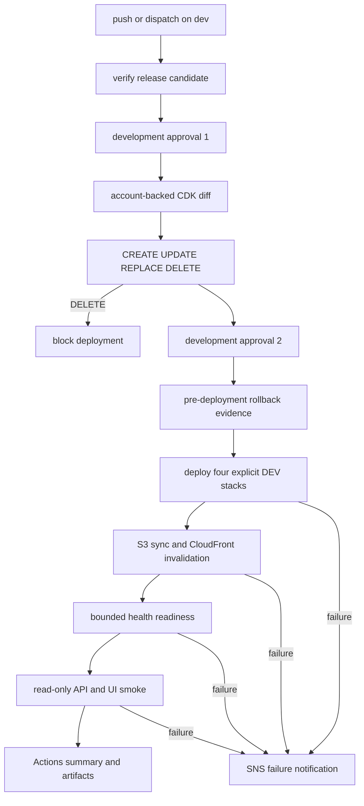

# AWS DEV Deployment Runbook

## Purpose And Authorization Boundary

This runbook covers the Block 28.6 protected AWS DEV delivery workflow. The
workflow source is implemented, but no AWS deployment has been executed by
Block 28.6. Running the workflow is a real AWS operation and requires separate
owner authorization after an account-backed diff review.

The workflow must never target production, enable either worker schedule, copy
production secrets, run a worker, call RentCast or OpenAI, send Telegram
messages, or publish a production notification. App Runner starts the existing
API composition root, which runs bundled migrations against the isolated DEV
database before listening. The second environment approval therefore also
authorizes the reviewed DEV schema migration.

## Delivery Architecture



The workflow is `.github/workflows/deploy-dev.yml`. Its concurrency group does
not cancel an in-progress deployment. The workflow accepts only `dev`; a manual
dispatch from another ref is skipped.

## One-Time GitHub And AWS Setup

Before the first run:

1. Create the GitHub environment named `development`.
2. Restrict its deployment branches to `dev` only.
3. Configure required reviewers. Preventing self-review is recommended when a
   second reviewer is available.
4. Configure environment secret `CPI_ALERT_EMAIL` with a DEV operations email.
5. Configure repository or environment variable `AWS_ACCOUNT_ID` with the
   exact non-root target account ID.
6. Configure `CPI_MONTHLY_BUDGET_USD`, or accept the workflow default of `20`.
7. Bootstrap CDK qualifier `hnb659fds` in `us-west-2` and `us-east-1`.
8. Deploy the reviewed Guardrails change through an administrator-controlled
   path so `cpi-github-deploy-dev` exists before GitHub can assume it.
9. Confirm that the DEV role trust subject is exactly
   `repo:Shaobangzhu/chaoran-property-intelligence:environment:development`.

The role can assume only the four named CDK bootstrap role types in the two
deployment regions. Direct workflow permissions are bounded to reviewed DEV
CloudFormation stacks, the deterministic DEV web bucket, the DEV App Runner
service, CloudFront invalidation on distributions tagged
`cpi:deployment-stage=dev`, and the DEV deployment-failure SNS topic.

## Approval And Diff Contract

The first `development` approval releases only the `plan` job. It does not run
a migration or mutate a stack. The job confirms the AWS account, runs
account-backed template-method CDK diff for these explicit stacks, and uploads
the raw and classified diff:

- `ChaoranPropertyIntelligenceGuardrails`
- `ChaoranPropertyIntelligenceDev`
- `ChaoranPropertyIntelligenceDevEdge`
- `ChaoranPropertyIntelligenceDevPublicApplication`

The classifier writes separate `CREATE`, `UPDATE`, `REPLACE`, and `DELETE`
sections to the Actions summary. Any `DELETE` fails the plan automatically.
Every `REPLACE` requires human review; replacement of Aurora, a database
secret, VPC, retained production resource, schedule, or OIDC identity blocks
approval. The artifact is retained for 30 days.

The second `development` approval is requested only after the plan succeeds.
Its job name states that API startup migrates DEV. Approval covers the exact
reviewed diff, immutable commit, and DEV migration. It never authorizes a
production migration.

Block 28.6 local-template comparison against the undeployed Block 28.5 source
baseline, excluding parameters and outputs, produced:

```text
CREATE: 3 deployment SNS resources
UPDATE: DEV role policy; DEV App Runner image; DEV CloudFront stage tag
REPLACE: 2 DEV worker task definitions; DEV web bucket and bucket policy
DELETE: none
```

The image changes are immutable revisions caused by tightening the Docker asset
context. The web bucket receives the stable name required for bounded direct
OIDC publishing permission. Block 28.5 records that the public stack is not
deployed, so these are source-template transitions rather than replacement of
live DEV resources. If an account-backed diff reports an existing bucket or any
stateful replacement, stop and reconcile deployed reality before approval.

## Verification And Deployment Contract

Before AWS credentials are requested, `verify` runs:

```text
full Vitest suite
local Playwright API and UI smoke
full typecheck
production build
DEV CDK synth
```

The verified `apps/web/dist` directory is uploaded once and downloaded by the
deploy job, binding static delivery to the tested workflow run. Allure results,
the generated report, Playwright HTML, traces, and failure screenshots are
uploaded and linked from the Actions summary.

The deployment job records the commit and pre-deployment outputs, prior DEV web
object versions, and prior App Runner image/status when they exist. It deploys
only the four explicit DEV stacks with both schedule contexts set to false.
After deployment it syncs the verified web build to
`cpi-dev-web-<account>-us-west-2`, waits for the CloudFront invalidation through
the AWS waiter, and polls `/api/health` with bounded attempts and per-request
timeouts.

No fixed sleep is used. A readiness timeout is a deployment failure.

## Read-Only AWS DEV Smoke

The remote Playwright step sets no local server. The workflow supplies the
exact HTTPS CloudFront origin through `CPI_PLAYWRIGHT_REMOTE_BASE_URL`.

The remote suite verifies:

- `GET /api/health` returns the database-independent `{ "status": "ok" }`
  contract and expected security headers
- an unauthenticated protected listing read returns `401`
- the private sign-in screen renders through CloudFront
- CloudFront supplies expected transport and frame-protection headers

Synthetic local login, listing, and logout journeys are intentionally skipped
in remote mode. AWS DEV smoke does not create a user, authenticate with a
deployed account, mutate listing data, or inspect database contents. External
browser requests outside the application origin remain blocked.

## Evidence And Notification

The deployment artifact contains only bounded operational metadata:

- commit and workflow run URL
- CDK outputs
- static asset SHA-256 manifest
- pre/post web object version metadata, capped at 1,000 entries
- pre/post App Runner service name, status, and immutable image identifier
- Allure and Playwright diagnostics

It must not contain credentials, secret values, session cookies, production
data, or private customer/listing payloads.

The dedicated topic is `cpi-dev-deployment-failures`. Successful runs do not
publish email. A failed deploy or smoke run publishes only environment, commit,
and Actions run URL. On the first deployment the topic may not yet exist, and
email delivery cannot begin until the subscription confirmation link is
accepted. Notification is therefore best-effort; Actions status and artifacts
remain authoritative.

## Rollback Decision And Recovery

Rollback is manual and evidence-driven. The workflow does not automatically
roll back infrastructure or a schema.

For an application-only failure:

1. Stop further deployment approval and preserve the failed run artifacts.
2. Identify the last-known-good App Runner image and S3 object versions from
   deployment evidence.
3. Review a new CDK diff that restores the prior immutable API image without
   replacing stateful resources.
4. Restore prior S3 object versions and invalidate CloudFront.
5. Run the same bounded health and read-only smoke checks.

Application rollback does not reverse a database migration. A migration issue
requires a separately reviewed forward fix or recovery plan. Do not execute
manual SQL as an improvised workflow recovery.

## First-Run Checklist

- explicit owner authorization for real AWS DEV changes
- exact target account confirmed
- both deployment regions bootstrapped
- DEV OIDC role present
- `development` environment limited to `dev` with required reviewers
- account-backed diff artifact reviewed by CREATE/UPDATE/REPLACE/DELETE
- no DELETE and no unsafe REPLACE
- DEV migration reviewed and authorized at approval 2
- both schedules remain disabled
- `CPI_ALERT_EMAIL` is DEV-only
- SNS confirmation accepted after topic creation
- smoke and rollback evidence reviewed after completion

Production deployment remains outside this runbook.

The local production-template comparison still reports two stateless ECS task
definition image revisions from the Docker context boundary. The DEV workflow
does not select the production application stack, and no production deploy was
run. A future production change must review those revisions independently.
