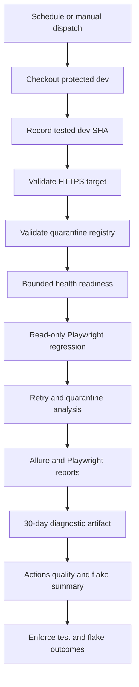

# Nightly AWS DEV Regression Runbook

## Purpose And Boundary

This runbook covers the Block 28.7 scheduled, read-only Playwright regression
against the public AWS DEV CloudFront origin. The workflow source is
implemented, but Block 28.7 does not execute a GitHub Actions run, access AWS,
deploy a stack, run a migration, enable a schedule, start a worker, call
RentCast or OpenAI, send Telegram, or publish SNS.

The nightly workflow is a test consumer, not a deployment mechanism. It has no
AWS credentials, no `id-token` permission, and no GitHub environment. It cannot
mutate infrastructure or read CloudFormation outputs.

## One-Time Setup

Before enabling meaningful scheduled runs:

1. Complete and explicitly authorize the first successful AWS DEV deployment.
2. Create repository variable `CPI_AWS_DEV_BASE_URL` with the exact CloudFront
   HTTPS origin, without a path, query, or fragment.
3. Confirm `dev` is protected and contains the compatible Playwright suite,
   flake tools, and quarantine registry.
4. Merge the nightly workflow to the repository default branch. GitHub runs
   scheduled workflows from the default branch, while this workflow explicitly
   checks out `dev` as its test source.
5. Review artifact visibility and retention for the repository.

The CloudFront URL is public routing metadata, not a secret. Do not put session
cookies, credentials, API keys, or secret values in this variable.

## Schedule And Concurrency

`.github/workflows/nightly-dev-regression.yml` runs at `09:23 UTC` daily and
also supports manual dispatch. The non-round minute reduces synchronized load
with common midnight schedules. Daylight-saving changes affect the equivalent
local Pacific time.

The concurrency group allows only one logical nightly run at a time and does
not cancel an in-progress regression. The job timeout is 30 minutes.

## Execution Contract

The health probe has six attempts, a ten-second interval, and a five-second
request timeout. This is state-based polling, not an arbitrary sleep.

Playwright runs every currently discovered deployed-system test. Remote mode
skips synthetic local login/logout journeys and executes only contracts that do
not require a DEV account or data mutation. The suite remains Chromium-first.

## Retry Policy

Nightly retries are explicitly set to one. The Playwright configuration accepts
only zero or one, so a workflow or local command cannot silently raise the
retry budget.

The JSON reporter is machine input for
`tools/flaky-tests/analyzePlaywrightResults.mjs`. The bounded analysis records:

- stable human-readable test ID
- attempt count and maximum retry index
- final Playwright status
- active quarantine owner and expiry when applicable
- up to 20 tests whose longest attempt is at least 10 seconds

It does not copy error messages, stack traces, stdout, stderr, request bodies,
responses, cookies, or attachments into the flake summary.

An unregistered retry fails the nightly gate even when Playwright passes on the
second attempt. A quarantined retry remains visible but may pass the flake gate.
A test that still fails after retry always fails through Playwright; quarantine
cannot convert a product or system failure into success.
Discovering zero tests also fails the analysis. Slow-test observations are
reported for investigation but do not fail the gate by duration alone.

## Quarantine Policy

`tests/flaky-tests.json` is the reviewed registry. It is empty at Block 28.7
completion. Every future entry must contain exactly:

- `testId`
- GitHub-handle `owner`
- bounded `reason`
- HTTPS `evidenceUrl`
- HTTPS `remediationUrl`
- `introducedOn`
- `expiresOn`

The maximum quarantine duration is 30 days. Expired entries, duplicate IDs,
future introduction dates, invalid links, missing metadata, unknown fields, and
quarantines whose test ID no longer exists all fail the gate.

To quarantine a confirmed flake:

1. Preserve at least one Actions run containing retry evidence and trace.
2. Open a remediation issue with an owner and a falsifiable investigation plan.
3. Copy the exact test ID from the retry analysis.
4. Add a registry entry in a reviewed PR with an expiry of 30 days or less.
5. Keep the test running. Do not add `test.skip`, arbitrary delays, or broadened
   retries as the quarantine mechanism.
6. Remove the entry with the fix. Extending expiry requires new evidence and
   explicit review; it is not routine maintenance.

## Outcomes

| Condition | Playwright | Flake gate | Nightly result |
| --- | --- | --- | --- |
| First-attempt pass | Pass | Pass | Pass |
| Retry pass, no registry entry | Pass/flaky | Fail | Fail |
| Retry pass, active registry entry | Pass/flaky | Pass with evidence | Pass with visible quarantine |
| All attempts fail | Fail | Report | Fail |
| Expired or malformed registry | Not trusted | Fail | Fail |
| Registry test ID is stale | Test may pass | Fail | Fail |
| DEV health never becomes ready | Not run | No JSON result | Fail |

## Artifacts And Privacy

The 30-day artifact contains Allure results/report, Playwright HTML output,
failure screenshots and traces, Playwright JSON, and bounded flake evidence.
The Actions page displays the tested `dev` SHA, Allure summary, retry counts,
quarantine state, and artifact link.

Do not publish the artifact externally until screenshots, traces, cookies,
request payloads, and response bodies have been reviewed. The bounded flake
JSON is safer for trend processing than raw Playwright output, but it is not a
public report by default.

## Known Identity Limitation

The workflow records the exact `dev` commit containing the test code. The API
does not yet expose a deployed release SHA, so Block 28.7 cannot prove that the
running AWS DEV web/API artifact came from that same commit. A deployment
failure or pending approval may leave AWS DEV behind `dev`.

Do not use nightly evidence as a production release attestation until Block
28.8 binds regression to an immutable deployed release identity.

## Failure Handling

The GitHub Actions failure and retained artifacts are authoritative. Nightly
does not assume AWS credentials solely to publish SNS; this keeps scheduled
read-only testing outside the deployment trust boundary. Investigate health,
test, retry, policy, and stale-quarantine failures from the summary before
rerunning. Do not repair a nightly failure with a deployment, migration, data
edit, or schedule change without separate authorization.
