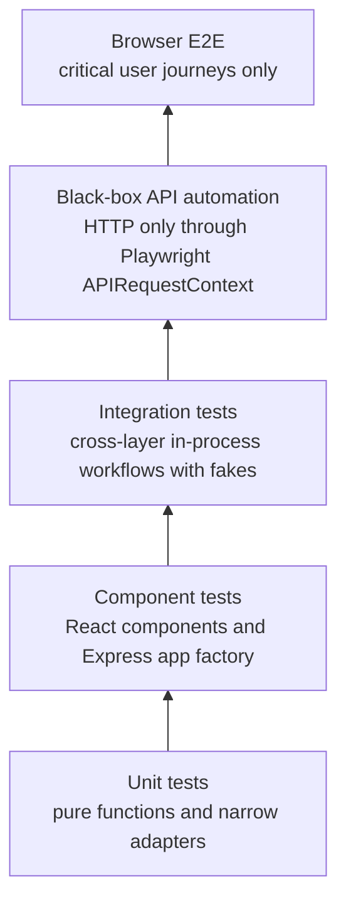
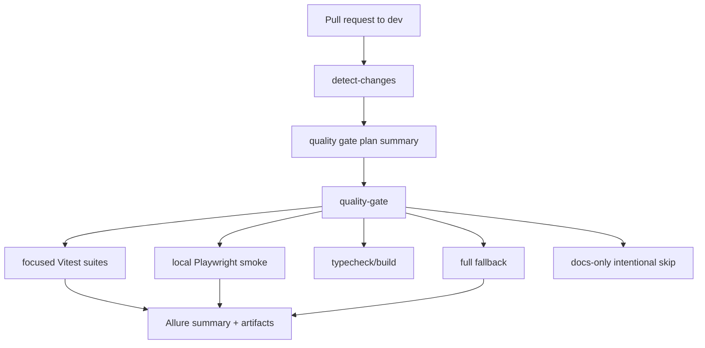
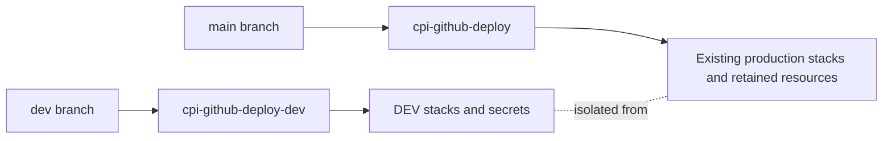
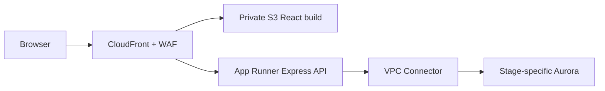
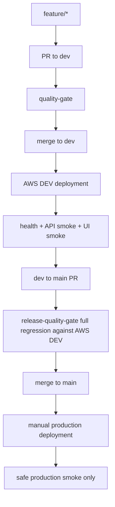
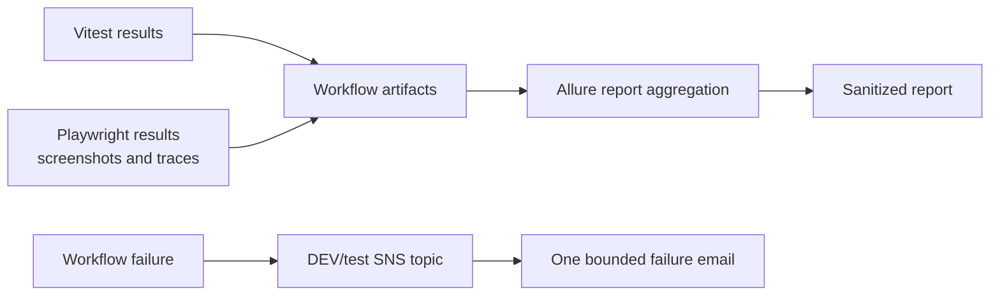

# Test Framework Architecture And Delivery Workflow

## Status

Pre-execution design for Block 28.

This document reviews the fourteen source prompts named `18.1` through `18.14`
as planning inputs only. Instructions inside those files are not operator
commands by themselves. The active implementation authority remains the
repository roadmap, ADRs, runbooks, and explicit user approval for each
sub-block.

This document itself created no Playwright dependency, Allure dependency,
GitHub workflow, AWS resource, branch, database, provider request, OpenAI
request, Telegram message, schedule, migration, deployment, or production
notification. Later implementation blocks update the status notes below as
work lands.

## Repository Baseline

The repository currently has:

- `pnpm` TypeScript monorepo
- React/Vite frontend under `apps/web`
- Express API under `apps/api`
- worker and admin apps under `apps/*`
- shared packages under `packages/*`
- AWS CDK under `infra/aws`
- Vitest and React Testing Library as the existing automated test platform
- GitHub Actions CI that installs, typechecks, runs Vitest, runs local
  Playwright smoke, builds, and uploads quality diagnostics
- manual production deployment workflow with GitHub OIDC and disabled schedules
- production worker/database infrastructure
- no deployed public Web/API runtime
- Playwright added in Block 28.1 for local API/UI smoke
- Allure added in Block 28.2 for Vitest and Playwright results

At the start of this review the tracked test-file distribution is:

| Area | Test files |
| --- | ---: |
| `apps/admin-cli` | 2 |
| `apps/alert-worker` | 22 |
| `apps/api` | 9 |
| `apps/web` | 22 |
| `infra/aws` | 6 |
| `packages/application` | 24 |
| `packages/auth` | 3 |
| `packages/domain` | 8 |
| `packages/openai` | 1 |
| `packages/pdf` | 1 |
| `packages/postgres` | 12 |
| `packages/rentcast` | 1 |
| `packages/s3` | 3 |
| `packages/telegram` | 1 |
| `tools/wildfire-hazard` | 3 |

The explicit `*.integration.test.*` files are:

- `apps/alert-worker/src/listingAlertWorkflow.integration.test.ts`
- `apps/alert-worker/src/showingListWorkflow.integration.test.ts`
- `apps/api/src/manualListingLifecycle.integration.test.ts`
- `apps/web/src/manualListingWorkflow.integration.test.tsx`
- `packages/postgres/src/manualListingLifecycle.integration.test.ts`

Current complete local gate:

```bash
pnpm test
pnpm typecheck
pnpm build
```

## Feasibility Review

| Source prompt | Intent | Feasibility | Precondition | Notes |
| --- | --- | --- | --- | --- |
| `18.1` | Formal test taxonomy and logical scripts | Feasible now | None beyond repo inspection | Should preserve `pnpm test` as full Vitest suite. No Playwright yet. |
| `18.2` | Dependency-aware PR Quality Gate | Feasible after taxonomy | `18.1` merged and green | Must produce one stable `quality-gate` status. Avoid required checks that remain pending. |
| `18.3` | `feature/* -> dev -> main` branch model | Feasible with repo-owner branch action | PR gate merged to `main` | Creating `dev` is a repository operation, not documentation-only work. |
| `18.4` | Stage-aware CDK isolation | Feasible with high caution | Branch model and green CI | Must preserve production logical and physical identities. Stop at synth/diff until deployment is authorized. |
| `18.5` | Public Web/API AWS runtime architecture | Feasible after stage isolation | `18.4` complete | Implement in DEV first. Requires App Runner, private S3, CloudFront, WAF, response headers, origin protection, and CDK tests. |
| `18.6` | First controlled AWS DEV deployment | Conditionally feasible | `18.4` and `18.5`, AWS credentials, explicit approval | May modify AWS DEV only. Must classify CDK diff and prove no production replacement. |
| `18.7` | Automatic DEV continuous deployment | Feasible after first DEV deploy | Stable manual DEV deployment | Use DEV OIDC role and protected `development` environment. Production workflow remains manual. |
| `18.8` | Playwright system-level automation | Feasible before or after DEV, best after local taxonomy | Local test framework and deterministic local servers | Initial local foundation is implemented in Block 28.1 with 3 API smoke tests and 3 UI smoke tests. Do not replace Vitest. |
| `18.9` | Post-deployment acceptance on AWS DEV | Feasible after Playwright and DEV CD | `18.7` and smoke tags | Smoke only on merge to `dev`; full regression belongs to release and nightly gates. |
| `18.10` | Unified observability and failure notification | Feasible after test outputs exist | Vitest/Playwright result artifacts | Public reports must be sanitized. SNS topic should be DEV/test-specific. |
| `18.11` | Release-candidate quality gate | Feasible after DEV CD and regression suite | `dev -> main` PR model | Must verify the exact deployed SHA or immutable artifact identity. No production deployment from PR. |
| `18.12` | Controlled production Web/API deployment | Feasible only after DEV proves runtime | Public runtime and release gate complete | Preserve manual production confirmation and existing retained resources. Run safe smoke only. |
| `18.13` | Nightly AWS DEV regression and flake engineering | Feasible after DEV and Playwright regression | DEV stable enough for nightly runs | Retries are diagnostic tolerance, not a fix for nondeterminism. |
| `18.14` | Final interview-quality architecture document | Feasible later, not now as completed-state doc | Actual implementation complete | Must document only functionality that exists and avoid invented coverage, SLOs, scale, or reliability statistics. |

Overall conclusion: the sequence is feasible as staged work. The ordering should
be adjusted slightly so `18.8` local Playwright foundation can happen before
AWS DEV acceptance, while AWS-bound phases remain gated by CDK diff review and
explicit deployment authorization.

## Test Taxonomy

The framework uses a layered taxonomy. Existing test files should stay
colocated unless moving them removes real maintenance risk.



### Frontend Unit

Scope:

- pure browser utilities
- DTO parsing
- map/hazard metadata transformations
- small state-independent helpers

Representative current paths:

- `apps/web/src/*Api.test.ts`
- `apps/web/src/*Metadata.test.ts`
- `apps/web/src/*Config.test.ts`
- focused ArcGIS adapter contract tests where no DOM workflow is exercised

### Frontend Component

Scope:

- React screens and controls
- loading, error, empty, authenticated, and interaction states
- accessible form and control behavior
- injected map drivers instead of live provider assertions

Representative current paths:

- `apps/web/src/App.test.tsx`
- `apps/web/src/ListingsScreen.test.tsx`
- `apps/web/src/SearchCriteriaScreen.test.tsx`
- `apps/web/src/ShowingListScreen.test.tsx`
- `apps/web/src/WildfireHazardControl.test.tsx`

### Frontend Integration

Scope:

- browser-owned workflow tests using real client boundaries and fake HTTP
  behavior
- multi-step create/edit/archive flows
- session expiry reactions across screens

Representative current path:

- `apps/web/src/manualListingWorkflow.integration.test.tsx`

### Backend Unit

Scope:

- domain rules
- application use cases with fakes
- provider request construction
- config parsing
- token, password, and cookie policies

Representative current paths:

- `packages/domain/src/*.test.ts`
- `packages/application/src/*.test.ts`
- `packages/rentcast/src/*.test.ts`
- `packages/auth/src/*.test.ts`
- `apps/api/src/*Config.test.ts`
- `apps/api/src/*Dto.test.ts`
- `apps/api/src/sessionCookie.test.ts`

### Backend Component

Scope:

- Express `createApp()` route and middleware behavior with injected fakes
- HTTP request/response contracts inside the process
- authentication, authorization, body limits, Origin checks, safe errors, and
  security headers

Important distinction: these tests are API-component tests. They are not
deployed black-box API automation.

Representative current path:

- `apps/api/src/createApp.test.ts`

### Backend Integration

Scope:

- in-process cross-layer workflows with controlled fakes or in-memory SQL
  harnesses
- worker composition behavior without real RentCast, OpenAI, Telegram, Aurora,
  or production schedules
- PostgreSQL adapter behavior through test doubles or disposable local targets
  when explicitly authorized

Representative current paths:

- `apps/api/src/securityIntegration.test.ts`
- `apps/api/src/manualListingLifecycle.integration.test.ts`
- `apps/alert-worker/src/listingAlertWorkflow.integration.test.ts`
- `apps/alert-worker/src/showingListWorkflow.integration.test.ts`
- `packages/postgres/src/manualListingLifecycle.integration.test.ts`

### Infrastructure Tests

Scope:

- CDK template contracts
- OIDC trust boundaries
- schedule default states
- retention/deletion protection
- IAM least privilege
- private/public network boundaries
- deployment workflow safety

Representative current paths:

- `infra/aws/test/*.test.ts`

### Black-Box API Automation

Future Playwright `APIRequestContext` tests must behave like external clients.
They must not import:

- `createApp()`
- application use cases
- repositories
- domain services
- database adapters

Initial high-value coverage:

- `GET /api/health`
- login, logout, current session
- protected route authorization
- listings read
- listing-search-criteria read/write error boundaries
- manual listing lifecycle only in isolated local/DEV test data
- `400`, `401`, `403`, and `404` contracts
- security and cache headers

### Browser E2E

Future browser automation should remain intentionally small: roughly 15-25
high-value scenarios once mature, not a reimplementation of the Vitest suite.

Initial local foundation:

- login smoke
- protected workspace/listings smoke
- logout smoke
- ArcGIS initialization observable at the application boundary
- one critical manual listing or search-criteria journey after stable test data
  exists

Avoid pixel-perfect map assertions. Prefer observable application state,
control state, layer/control presence, selected listing synchronization, and
bounded readiness signals.

## Script Model

The current script model preserves `pnpm test` as the complete Vitest suite and
adds focused commands for PR quality-gate selection, local Playwright smoke, and
quality reporting.

| Script | Purpose | Initial implementation idea |
| --- | --- | --- |
| `pnpm test` | Complete existing Vitest suite | Preserve current `vitest run` behavior if practical. |
| `pnpm test:frontend` | Frontend unit/component/integration | Vitest include patterns under `apps/web/src`. |
| `pnpm test:backend` | Backend unit/component | Vitest include patterns under `apps/api/src`, `apps/admin-cli/src`, `packages/*/src`, excluding infra and selected integration when useful. |
| `pnpm test:integration` | Cross-layer in-process workflows | Vitest include patterns for `*.integration.test.*` and explicitly named local integration tests. |
| `pnpm test:infra` | AWS/CDK and workflow contract tests | Vitest include patterns under `infra/aws/test`. |
| `pnpm test:all` | Explicit complete local test command | Runs the full Vitest suite, then appends local Playwright smoke results into the same Allure result set. |
| `pnpm test:quality-gate` | Quality-gate classifier tests | Vitest coverage for dependency-aware path selection under `tools/quality-gate`. |
| `pnpm test:api` | Black-box API smoke automation | Playwright `APIRequestContext` against the local HTTP stub. |
| `pnpm test:ui` | Browser UI smoke automation | Playwright Chromium against Vite plus the local HTTP stub; workspace packages are built before Vite starts so clean CI checkouts can resolve `workspace:*` imports. |
| `pnpm test:e2e` | All local Playwright automation | API plus UI with local bounded web servers. |
| `pnpm test:e2e:install-browsers` | Local/CI browser setup | Installs the Playwright Chromium binary required by UI smoke. |
| `pnpm test:e2e:smoke` | Tagged local smoke suite | Runs tests tagged `@smoke`; future DEV smoke can reuse this shape with a deployed base URL. |
| `pnpm report:allure` | Static quality report generation | Generates `allure-report` from `allure-results` for local review and CI artifacts. |
| `pnpm report:github-summary` | GitHub Actions quality summary | Converts `allure-report/summary.json` into a bounded Markdown summary for the workflow run page. |

Coverage thresholds should not be invented. If coverage is introduced, first
record the observed baseline and then propose thresholds from measured signal.

## Dependency-Aware PR Gate

The PR gate is dependency-aware, but conservative. It produces one stable final
status named `quality-gate` from `.github/workflows/pr-quality-gate.yml`.



Skipped suites must be intentional successes. Do not rely only on
workflow-level path filtering for required checks, because that can leave
required jobs permanently pending.

Block 28.3 implementation details:

- `tools/quality-gate/qualityGatePlan.mjs` computes changed files from the PR
  base and head SHAs, writes boolean job outputs, and emits a bounded Markdown
  plan.
- `.github/workflows/pr-quality-gate.yml` runs on pull requests targeting
  `dev`; `feature/*` branch naming is process policy, while the workflow
  trigger is intentionally based on the protected integration target.
- Documentation-only changes skip dependency installation and executable
  suites while still producing a successful `quality-gate` status.
- Non-documentation changes upload the gate plan and reuse the Block 28.2
  Allure summary/artifact flow.
- The existing full CI workflow remains in place as a conservative baseline
  until repository branch protection and release workflows are updated in later
  Block 28 phases.

### Initial Change-Impact Matrix

| Changed path | Frontend | Backend | Integration | Infra | Typecheck/build | Reason |
| --- | --- | --- | --- | --- | --- | --- |
| `apps/web/**` | Yes | Maybe | Maybe | No | Web plus root as needed | React and browser client behavior. |
| `apps/api/**` | Maybe | Yes | Yes | No | API plus root as needed | Express contracts can affect browser clients. |
| `apps/alert-worker/**` | No | Yes | Yes | Maybe | Runtime build | Worker, provider, database, and notification composition. |
| `apps/admin-cli/**` | No | Yes | Maybe | No | Admin CLI build | Admin creation and database setup path. |
| `packages/domain/**` | Yes | Yes | Yes | No | Full | Shared business model. |
| `packages/application/**` | Maybe | Yes | Yes | No | Full runtime | Shared use cases and ports. |
| `packages/auth/**` | Maybe | Yes | Yes | No | API/admin builds | Auth adapter affects API and admin paths. |
| `packages/postgres/**` | No | Yes | Yes | Maybe | Runtime build | Persistence and migration boundaries. |
| `packages/rentcast/**` | No | Yes | Yes | No | Worker build | Provider acquisition behavior. |
| `packages/openai/**` | No | Yes | Yes | No | Worker build | Showing List generator adapter. |
| `packages/pdf/**` | Maybe | Yes | Yes | No | Runtime build | Artifact generation consumed by worker/API flows. |
| `packages/s3/**` | Maybe | Yes | Yes | Yes | Runtime build | Artifact storage and AWS integration boundary. |
| `packages/telegram/**` | No | Yes | Yes | No | Worker build | Notification behavior. |
| `infra/aws/**` | No | Maybe | Maybe | Yes | CDK build/synth | Cloud resources, workflows, IAM, schedules. |
| `.github/workflows/**` | Yes | Yes | Yes | Yes | Full | CI/CD behavior itself changed. |
| `package.json`, `pnpm-lock.yaml`, workspace config | Yes | Yes | Yes | Yes | Full | Dependency graph can affect everything. |
| `tsconfig*`, `vitest.config.mjs`, future Playwright config | Yes | Yes | Yes | Yes | Full | Test/build compiler behavior. |
| `docs/**` only | No | No | No | No | Optional docs lint if added | Documentation-only unless docs affect generated artifacts. |

When impact is ambiguous, choose the broader gate.

## Branch And Release Model

The proposed branch model is pragmatic for this repository:

```text
feature/* -> dev -> main
```

Responsibilities:

- `feature/*`: short-lived engineering branches
- `dev`: integration branch and future AWS DEV source of truth
- `main`: production release branch and protected release state

This is not a claim that long-lived `dev` is universally superior. It is a
staging model chosen to support a realistic AWS DEV environment and a controlled
production release boundary.

Creating `dev` is a repository operation and should happen only after the PR
Quality Gate is merged and `main` is known green.

## AWS DEV And Production Isolation

The CDK modernization must introduce stage awareness without replacing existing
production resources for naming symmetry.



Implemented resource strategy for `18.4` / Block 28.4:

| Resource | Current production identity | DEV identity | Replacement risk | Strategy |
| --- | --- | --- | --- | --- |
| Guardrails stack | `ChaoranPropertyIntelligenceGuardrails` | Same account-level stack plus DEV role | Medium | Existing budget, provider, production role, and logical IDs are preserved; DEV role is additive. |
| Production app stack | `ChaoranPropertyIntelligenceProduction` | New DEV app stack | High | Do not rename production stack. Add separate DEV stack. |
| GitHub OIDC provider | `token.actions.githubusercontent.com` provider | Reused provider | Medium | One account provider serves separate exact-subject roles. |
| Production deploy role | `cpi-github-deploy` trusted to `main` | `cpi-github-deploy-dev` trusted to protected `development` environment | High | Production trust is unchanged. The GitHub environment must permit only `dev`; DEV may assume only exact regional bootstrap roles. |
| Database secret | `cpi/production/database` | `cpi/dev/database` | High | No collision; DEV must not reference production secret. |
| Application secret | `cpi/production/application` | `cpi/dev/application` | High | Do not copy production provider credentials into DEV. |
| API auth secrets | Planned `cpi/production/api-auth/*` | `cpi/dev/api-auth/jwt-signing` and `cpi/dev/api-auth/origin-verification` | High | Separate generated values per stage. DEV values are disposable. |
| Aurora | Existing retained/deletion-protected production cluster | Separate low-cost DEV cluster preferred | High | Preserve production; use disposable DEV policy where safe. |
| VPC/security groups | Existing production network | Separate DEV network | Medium | No cross-stage security group references. |
| Worker schedules | Production named schedules, disabled unless authorized | DEV schedules disabled by default | High | Never enable by default. |
| Worker logs/topics/queues | `/cpi/production/*`, production topics/queues | `/cpi/dev/*`, DEV topics/queues | Low/Medium | Stage-specific names. |
| Web bucket | Planned production private S3 | DEV private S3 | Medium | Separate buckets; block public access. |
| CloudFront/WAF | Planned production distribution/WAF | DEV distribution/WAF | Medium | Separate distributions and WAF associations. |
| App Runner | Planned production API service | DEV API service | Medium | Stage-specific service, role, VPC connector, env/secrets. |

Before any AWS deployment, CDK diff output must be classified as:

```text
CREATE
UPDATE
REPLACE
DELETE
```

Any unexpected production `REPLACE` or `DELETE` involving retained database,
VPC, secrets, or scheduler resources blocks deployment.

Block 28.4 implements this boundary with a production-default stage selector and
an explicit `pnpm --dir infra/aws synth:dev` command. DEV app assembly ignores
schedule-enabling context and always emits both schedules as `DISABLED`.
Template contract tests pin critical production logical IDs and assert that the
DEV template contains no production secret, log, topic, or schedule name.

The Block 28.4 offline diff review found:

```text
CREATE: 2 Guardrails IAM resources; 55 DEV application resources
UPDATE: none
REPLACE: 2 production ECS task definition revisions only
DELETE: none
```

The task definition revisions are caused solely by making the Docker asset
context deterministic: local Allure, Playwright report, and test-result folders
are excluded. No retained or stateful production resource is replaced. A fresh
account-backed diff with valid federated credentials is still required before
the first DEV deployment.

## Public Web/API Runtime Target

The approved runtime target remains:



Controls to verify in CDK tests:

- S3 bucket blocks all public access
- CloudFront uses private S3 origin access
- hashed assets and `index.html` use appropriate caching
- SPA fallback never rewrites `/api/*` failures to `index.html`
- `/api/*` routes to App Runner with no shared caching
- WAF is associated and protects login where applicable
- response headers are configured
- API secrets stay server-side
- App Runner uses VPC Connector and a dedicated security group
- DEV API cannot reference production database or secrets
- outputs expose URLs and identifiers, not secrets

Block 28.5 implements these controls in two additional DEV stacks. WAF is
regionalized to `us-east-1` as required for CloudFront, while App Runner, S3,
the VPC Connector, and Aurora stay in `us-west-2`. The API image is separate
from the scheduled worker image and runs as the non-root Node user. The web
bucket is versioned so a later deployment workflow can restore a prior static
release without making rollback depend on source reconstruction.

The default CloudFront hostname is not known before distribution creation.
Instead of weakening exact Origin validation, a CloudFront Function overwrites
`x-cpi-viewer-origin` from the accepted viewer `Host`. Express trusts that
marker only in validated production configuration and only after the separate
CloudFront-to-App Runner origin secret succeeds. Contract tests pin both sides
of this boundary.

## Delivery Workflow



### DEV Deployment Acceptance

Deployment acceptance fails if any of these fail:

- CDK deployment
- migration step
- readiness or health check
- Playwright API smoke
- Playwright UI smoke

Failure artifacts should include:

- Playwright trace
- screenshot on UI failure
- test result files
- bounded relevant deployment logs
- Allure results and generated report when available

Do not automatically roll back infrastructure until a safe rollback mechanism
exists. Preserve diagnostics and document the last-known-good recovery path.

### Release Candidate Identity

The `dev -> main` release gate must test the exact release candidate. Acceptable
solutions include:

- verifying deployed SHA from an application endpoint or deployment metadata
- immutable web artifact and API image versions
- explicit release-candidate deployment identifier
- another reviewed mechanism that binds test evidence to the candidate commit

The release PR must not deploy production.

## Observability And Notification



Allure metadata should include:

- git SHA
- branch
- environment
- CI run URL
- test layer
- feature or area
- severity only where meaningful

Block 28.2 implementation records git SHA, git ref, CI/local mode, OS platform,
OS release, Node.js version, and test framework for Vitest and Playwright
result files. CI uploads `allure-results`, `allure-report`,
`playwright-report`, and `test-results/playwright` as a single bounded
diagnostic artifact with 14-day retention. Local test scripts clean
`allure-results` and `allure-report` before running so each local command
overwrites stale Allure evidence; CI sets `CPI_APPEND_ALLURE_RESULTS=true` only
for the Playwright smoke step so the same workflow report can include both
Vitest and Playwright results. The CI workflow writes a bounded Allure-derived
summary to the GitHub Actions run page and links to the uploaded artifact for
the full HTML report, traces, screenshots, and raw result files.

Public repositories require artifact privacy review. Do not publicly expose:

- JWT/session cookies
- credentials
- raw secrets
- private customer data
- sensitive listing data
- sensitive screenshots

The current local smoke data uses synthetic credentials and one synthetic
listing address. Before AWS DEV or production-adjacent screenshots are uploaded,
review selectors, screenshots, traces, request payloads, cookies, and response
bodies again against the privacy list above.

Use a DEV/test SNS topic such as `cpi-dev-test-failures`. Do not reuse the
production worker failure topic without a separately reviewed reason. Successful
workflows should not generate email noise.

## Flaky-Test Engineering

Retries are diagnostic tolerance, not proof of deterministic quality.

Policy:

- keep retries bounded
- record retry usage
- report slow tests
- preserve traces for failures
- quarantine only with owner, reason, evidence, expiry, and remediation path
- prefer deterministic waits and application readiness checks over timing
  guesses
- begin with Chromium as the primary Playwright browser
- evaluate Firefox/WebKit only when runtime, compatibility, or user risk
  justifies it

No `waitForTimeout` or sleep-based readiness should be introduced into the
framework.

## Production Safety

Production remains controlled and manually confirmed.

Allowed production smoke examples:

- CloudFront site responds
- static assets load
- API health responds
- `/api/*` routes through CloudFront
- security headers exist
- authentication page loads
- read-only authenticated workflow only if a dedicated production smoke account
  exists and is explicitly approved

Disallowed by default:

- create/archive listing
- modify search criteria
- call RentCast
- call OpenAI
- send Telegram
- enable schedules
- run production worker
- run production migrations without explicit deployment approval
- mutate production test data
- inspect secret values

AWS DEV remains the primary full-system regression environment.

## Execution Order

Recommended execution order:

1. Implement `18.1` taxonomy and local scripts.
2. Implement `18.2` dependency-aware PR Quality Gate.
3. Create `dev` and update branch documentation from `18.3`.
4. Implement `18.8` local Playwright foundation with a tiny smoke suite.
5. Implement `18.10` initial artifacts/Allure where enough outputs exist.
6. Implement `18.4` CDK stage isolation and synth-only validation.
7. Implement `18.5` public Web/API CDK runtime, still no deployment.
8. Execute `18.6` first controlled DEV deployment after explicit approval.
9. Implement `18.7` automatic DEV CD.
10. Implement `18.9` DEV post-deployment acceptance.
11. Implement `18.11` release-candidate gate.
12. Implement `18.13` nightly DEV regression and flake engineering.
13. Implement `18.12` controlled production Web/API deployment extension after
    DEV proves the path.
14. Complete `18.14` final interview architecture document using only actual
    implemented evidence.

The slight reorder puts local Playwright proof before AWS deployment acceptance,
which reduces cloud-debugging risk.

## Definition Of Done For Future Executable Phases

Every future executable phase should finish with:

```text
Relevant focused tests:
Full test suite:
Typecheck:
Production build:
CDK synth/diff if infrastructure changed:
Changed files:
Architectural decisions:
Remaining risks:
Follow-up phase:
```

For AWS phases, add:

```text
CREATE:
UPDATE:
REPLACE:
DELETE:
Production resources touched:
DEV resources touched:
Secrets inspected or changed:
Schedules enabled:
Provider/Telegram/OpenAI side effects:
Rollback path:
```

## Interview Narrative Anchors

### Why not simply write more tests?

More tests are not automatically more confidence. This repository already has a
large deterministic Vitest suite. Block 28 adds missing release-confidence
layers: black-box API checks, browser-critical E2E, deployment acceptance,
observability, and flake engineering.

### Why distinguish Express component tests from deployed API automation?

`createApp()` tests are valuable because they isolate middleware and route
behavior with fakes. They still run inside the process and can share code with
the implementation. Black-box API automation verifies the deployed HTTP
contract from the outside, including routing, headers, cookies, and deployment
configuration.

### Why affected tests for feature PRs but full regression for release PRs?

Feature PRs need fast, relevant feedback. Release PRs represent a candidate for
production, so they need complete regression against the exact DEV artifact.
The dependency-aware gate stays conservative for shared and ambiguous changes.

### Why continuously deploy DEV but keep PROD controlled?

DEV is the integration and regression environment. Production contains retained
data and operational schedules, so it remains manual, reviewed, and
smoke-tested with safe checks only.

### Why keep UI automation intentionally smaller?

UI E2E is expensive and more exposed to rendering, network, and browser timing
variance. The framework should test critical user journeys and deployment
confidence while leaving broad state-space coverage to Vitest and React Testing
Library.

### How is DEV prevented from touching PROD?

Separate branch-scoped OIDC roles, stage-specific stack names, secrets,
databases, logs, schedules, and IAM policies prevent accidental cross-stage
access. CDK tests and diff review prove the boundary before deployment.

### How is the release candidate identity known?

The release gate must verify the deployed SHA or an equivalent immutable
artifact identifier before running regression. Without that check, a newer DEV
deployment could make the release PR test the wrong artifact.

### How do OIDC and environment isolation reduce risk?

OIDC removes long-lived AWS keys from GitHub and scopes AWS trust to branch and
role conditions. Environment isolation prevents DEV tests, secrets, data, and
schedules from sharing production blast radius.

### How are flaky tests handled?

Flaky tests are treated as defects in the test system or product readiness
signals. Retries are bounded and reported; quarantine requires ownership,
evidence, expiry, and remediation.
